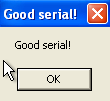
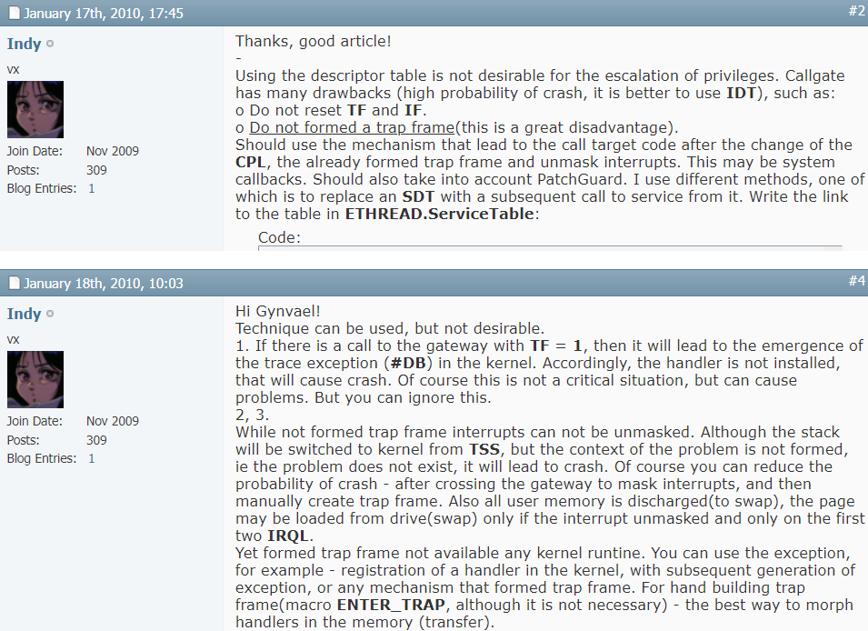

# cagrackme 1.0

short crackme for Windows XP SP3 (32 bit version)

ring0 stuff. IMO very fun x-)

## intructions

install Windows XP SP3 (32 bit version)

Download this repository in C:\

execute cagrackme.bat

## challenge

Get a Good Serial! messagebox

### hint 

https://github.com/therealdreg/ida_bochs_windows

http://www.cse.iitm.ac.in/~chester/courses/16o_os/slides/6_Interrupts.pdf

https://github.com/therealdreg/x86osdev

https://wiki.osdev.org/Getting_to_Ring_3

## real challenge

Learn what the hell is happening

why this crackme its "stable"? Is there something new/innovative/imaginative compared to other public resources?

why does not exist a race condition in this POC? (look Indy explanation)

what are the different kind of weird things/crashes while debugging? and why?

if you remove the hook by hand what happen if you debug the program? and why?

if you remove the hook by hand and run the program... what happen? and why?

if you remove the popf (for TF bit) and run the program, why it can crash sometimes? 

if you remove the hook, the popf (for TF bit) and after that you do a step in call far why it crash? 

then... the popf + hook its for antidebug? ;-)

**if you can't answer these questions you don't understand cagrackme**

## Solution + Source Code

https://github.com/therealdreg/dregate
